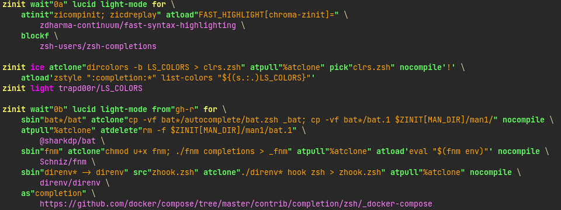
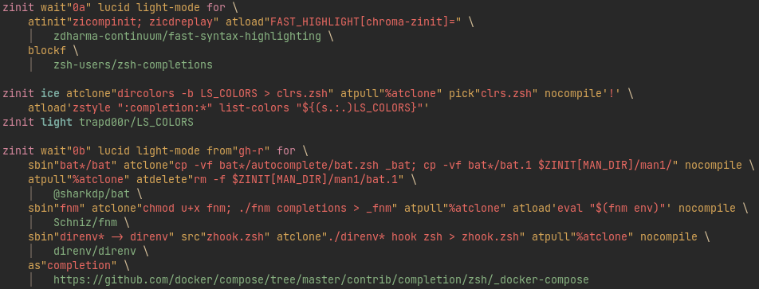

# zinit-vim-syntax

A Vim syntax definition for Zinit commands in any file of type `zsh`.

## Installation

Load as a Vim plugin. E.g. when using vim-plug, add to `~/.vimrc`:

```vim
Plug 'zdharma-continuum/zinit-vim-syntax'
```

and then issue the `:PlugInstall` command.

### Manual Installation

To install the syntax copy the file `syntax/after/zsh.vim` under the path
`~/.vim/syntax/after`.

## Examples

The default theme:



The theme: `eddyekofo94/gruvbox-flat.nvim`:



## TODO

1. Highlight user and plugin with different colors.
2. Fix bugs.
3. Other?
